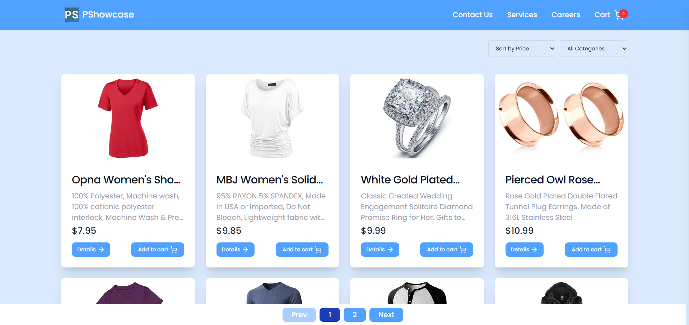
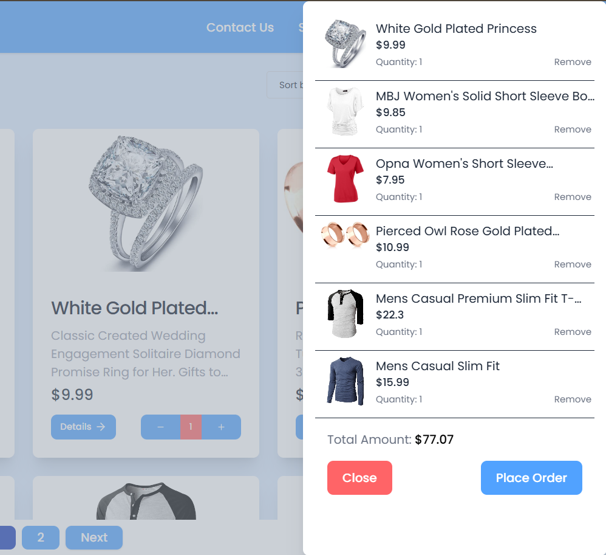
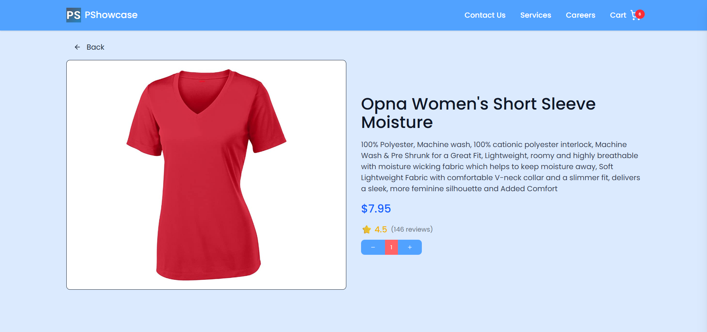

# 🛍️ Product Showcase

A modern and responsive **Product Showcase** web application built using **React**, **TypeScript**, and **Tailwind CSS**. This project displays a catalog of products with interactive UI and clean design.

## 📷 Screenshots




## 🚀 Features

- Built with **React** + **TypeScript**
- Styled using **Tailwind CSS**
- Fully **responsive** across devices
- Product details with image, price, rating, and description
- Sorting and filtering support
- Clean and modular codebase

## 📦 Getting Started

### Prerequisites

- Node.js >= 16.x
- npm >= 8.x

### Installation

1. Clone the repository:

```bash
git clone https://github.com/vikaschouhan97/product-showcase
cd product-showcase
```

2. Install dependencies:

```bash
npm install
```

3. Start the development server:

```bash
npm run dev
```

4. To build for production:

```bash
npm run build
npm start
```

## 📁 Project Structure

```
src/
├── components/       # Reusable UI components
├── content/            # Page-level components
├── types/            # TypeScript interfaces and types
├── assets/           # Static files and images
├── App.tsx
├── main.tsx
└── ...
```

## 🙌 Acknowledgements

- [React](https://reactjs.org/)
- [TypeScript](https://www.typescriptlang.org/)
- [Tailwind CSS](https://tailwindcss.com/)